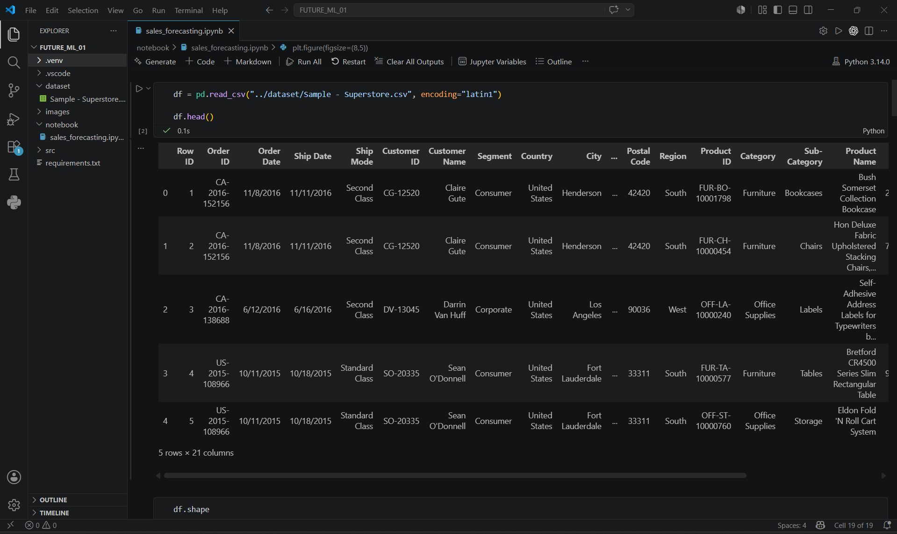
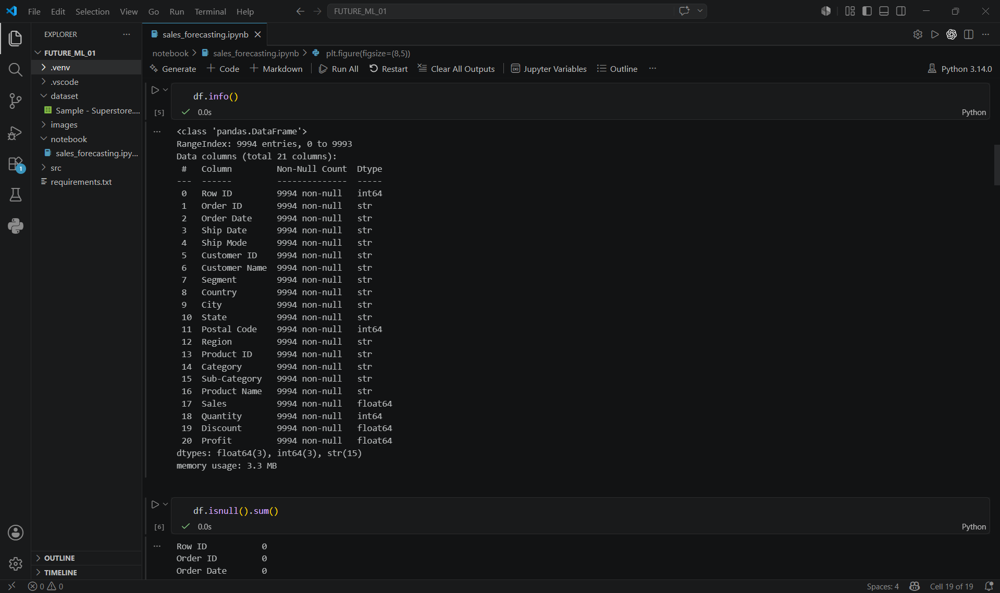
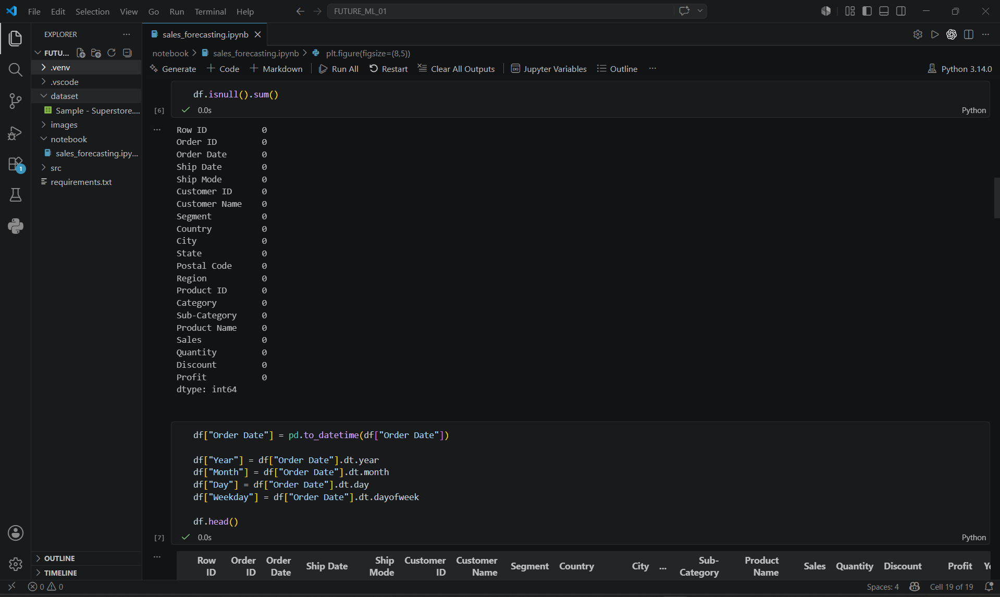
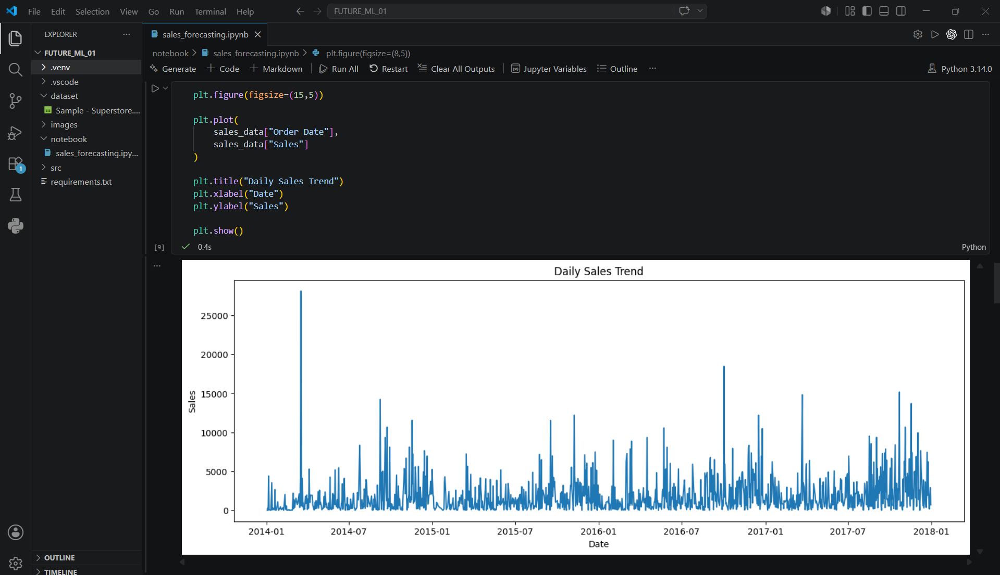
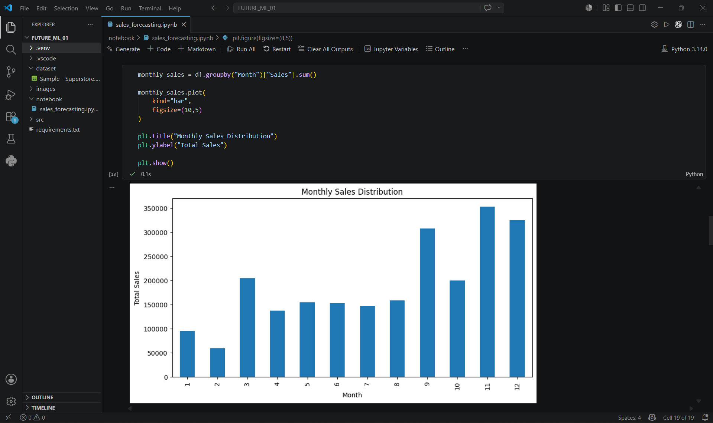
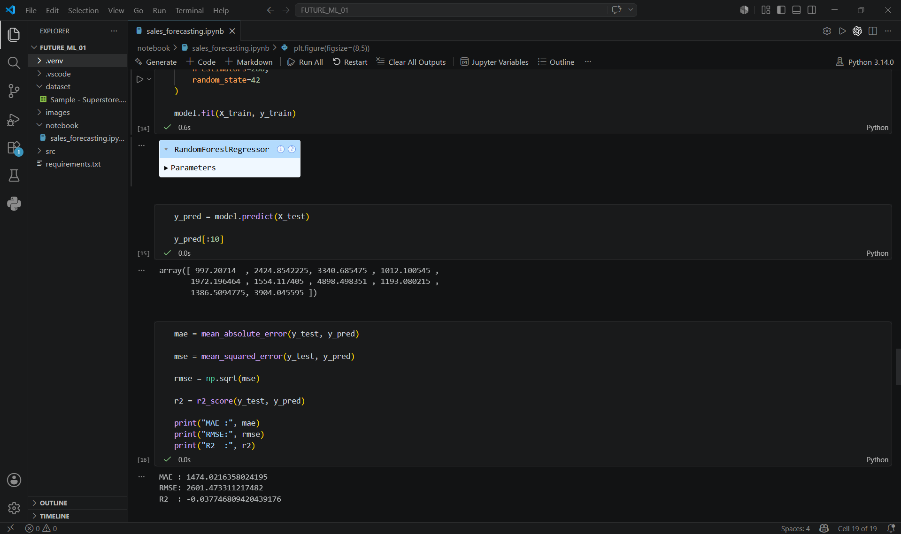
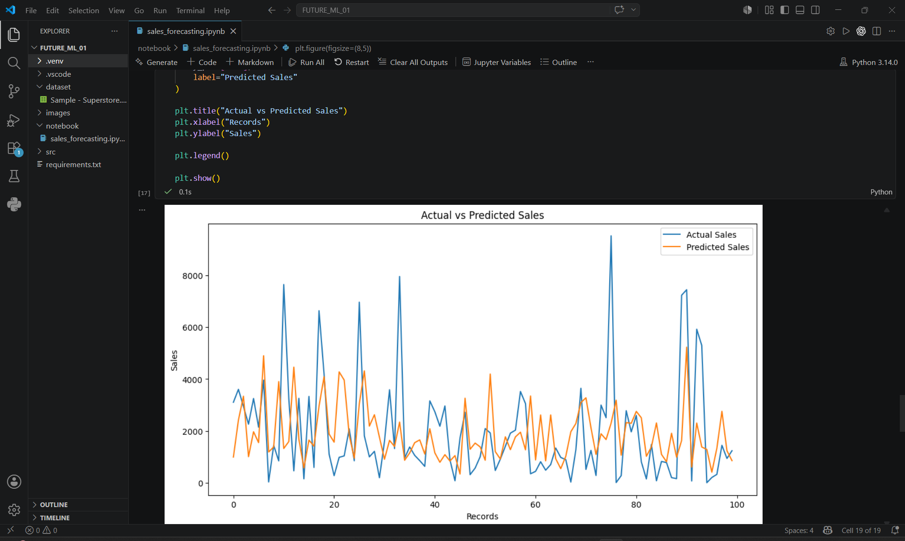
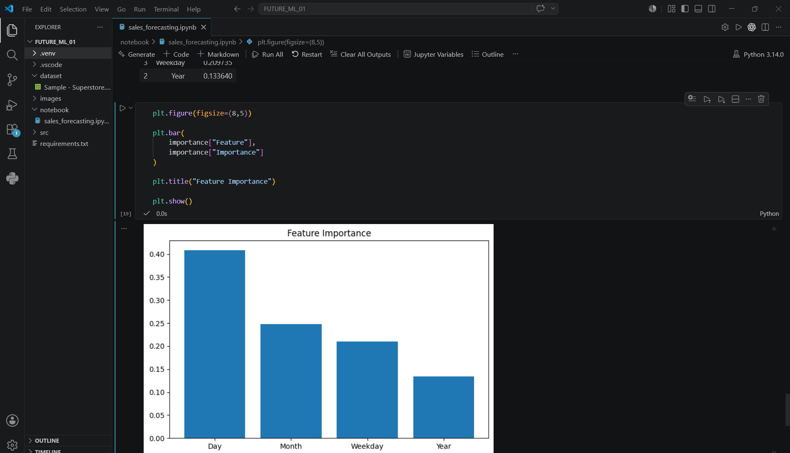
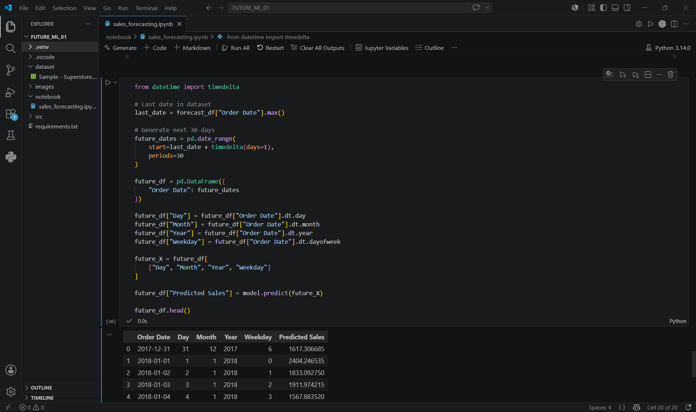
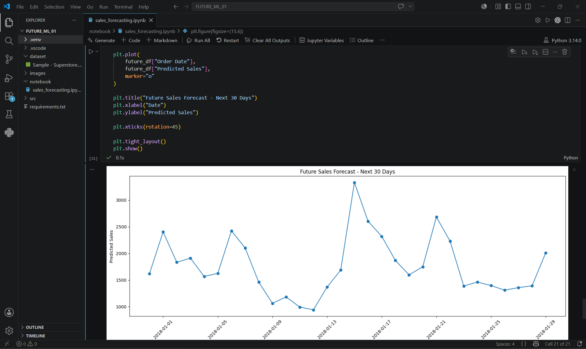

# 📈 Sales & Demand Forecasting for Businesses

Machine Learning project developed as part of the Future Interns ML Internship Program.

## 📌 Project Objective

The goal of this project is to analyze historical sales data and build a machine learning model capable of forecasting future sales trends.

Businesses can use these forecasts for:

- Inventory planning
- Demand prediction
- Resource allocation
- Strategic decision making

---

## 🛠 Technologies Used

- Python
- Pandas
- NumPy
- Matplotlib
- Scikit-Learn
- Jupyter Notebook

---

## 📂 Dataset

Dataset Used:

Sample Superstore Dataset

Features include:

- Order Date
- Sales
- Profit
- Quantity
- Category
- Customer Information
- Region

---

## 📊 Data Exploration

### Dataset Preview



### Dataset Information



### Missing Values Check



---

## 📈 Exploratory Data Analysis

### Daily Sales Trend



### Monthly Sales Distribution



---

## 🤖 Machine Learning Model

Model Used:

Random Forest Regressor

Features Used:

- Day
- Month
- Year
- Weekday

Target Variable:

- Sales

---

## 📉 Model Evaluation

### Performance Metrics



### Actual vs Predicted Sales



---

## 🔍 Feature Importance



The model identifies which date-related features have the greatest impact on sales forecasting.

---

## 🚀 Future Sales Forecast

### Forecast Data Sample



### Next 30 Days Forecast



---

## 📁 Project Structure

```text
FUTURE_ML_01
│
├── dataset
├── images
├── notebook
├── src
├── requirements.txt
└── README.md
```

---

## 📚 Learning Outcomes

- Data Cleaning
- Exploratory Data Analysis
- Feature Engineering
- Time Series Feature Creation
- Machine Learning Regression
- Model Evaluation
- Sales Forecasting

---

## 👨‍💻 Author

Roopesh Chalasani

Future Interns Machine Learning Internship
